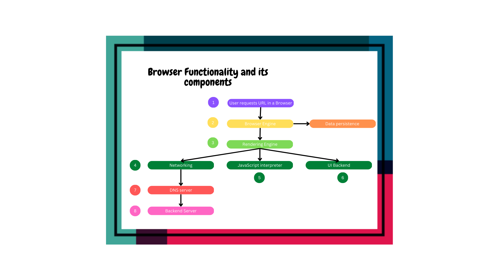

Exercise1.1:1.

When a user enters an URL in the browser, how does the browser fetch the desiredresult ? Explain this with the below in mind and Demonstrate this by drawing a diagram for the same.(2-3hours)

a.What is the main functionality of the browser?
b.High Level Components of a browser.
c.Rendering engine and its use.
d.Parsers (HTML, CSS, etc)
e.Script Processors
f.Tree construction
g.Order of script processing
h.Layout and Painting

Guidelines:

1.Submit this assignment on GIT - Answer should be in readme File (with images) on GIT.
2.Candidates should be able to explain how a browser works.
3.What are the high level components of a browser?
4.How each component works with each other. (For example: Networking component isthe one which makes HTTP calls, Data storage component is a browser’s persistencelayer which saves data locally such as Cookies and Local Storage.
5.How Parsing works and its importance.
6.The order of execution of scripts.

Outcome:
1.Under the hood understanding of how a browser works.
2.What are the features a browser provides?
3.What a browser is capable of doing.
4.How a web page is translated from a string in a URL to a webpage.

Answers:

Main functionality of the browser

Then main functionality of the browser is to get a desired information in a web page from the web. Then information will be requested/delivered via Hyper Text Transfer Protocol (HTTP). 

working of browser 

-IF user enters a URL  i.e https://sensonics2k21.github.io/eie/ (this link will pass through browser engine  and rendering engine)
-Rendering engine will make a call with its networking functionality to DNS Server 
-DNS server will get the IP of the given URL (https://sensonics2k21.github.io/eie/)
-With the found IP It will connect with the server which has sensonics2k21
-It will return a response of HTML,CSS,JS or XML file to the browser i.e (Rendering Engine)
- Rendering engine is responsible for rendering the web page from a html or xml file and giving style by rendering css file.
- if it requires any default components like combo box it will be in UI backedn 
- If the page has some JS functionalities it will be take care by  java script interpreter.
-data storage will contain cache and cookies for the webpage 

High Level Components of a browser.

1. Browser engine
2. rendering engine
3. Networking
4. JavaScript interpreter
5. UI backend
6. data persistance

Rendering engine and its use.

Rendering engine responsible for rendering a specific web page.It use to render HTML,XMLL, styles like css etc to bring up the webpage which User needs. each browser has different  renderers for example safari has webKIT where as chrome has blink

Parsers (HTML, CSS, etc)

HTML goes through a process called tokenization where all programing language will under go tokenization i.e it will spilt the program into several tokens and so it can get which is the starting tag and which is the ending tag what tag is inside what take this will result in DOM Tree.

HTML -> Tokenization -> DOM Tree

Same like HTML CSS will also  under go same process it will result in CSSOM Tree

CSS -> Tokenization -> CSSOM Tree

Rendering Tree 

Rendering Tree will merge DOM Tree and CSSOM Tree which will go to layout. layout positions all  the components like height, width position etc. after this it will go to painting this will  give color to the layout .

Rendering Tree => Layout => Paint 

Script Processors 

The script processor executes Javascript code to process an event. The processor uses a pure ECMAScript.

order of scripting

-Execution Stages
-Time of Processing
-Order of Processing
-Processing In Scripts
